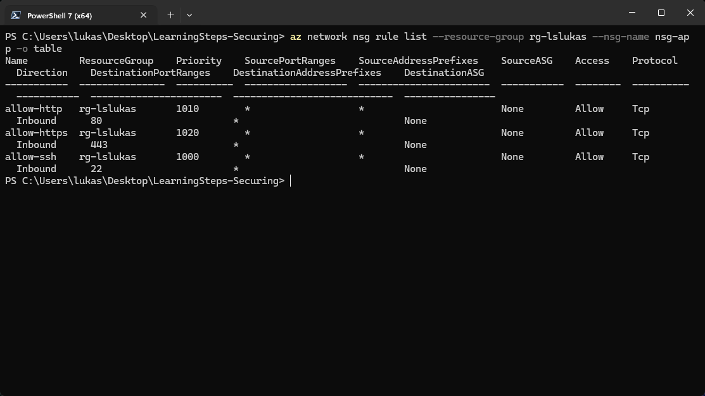
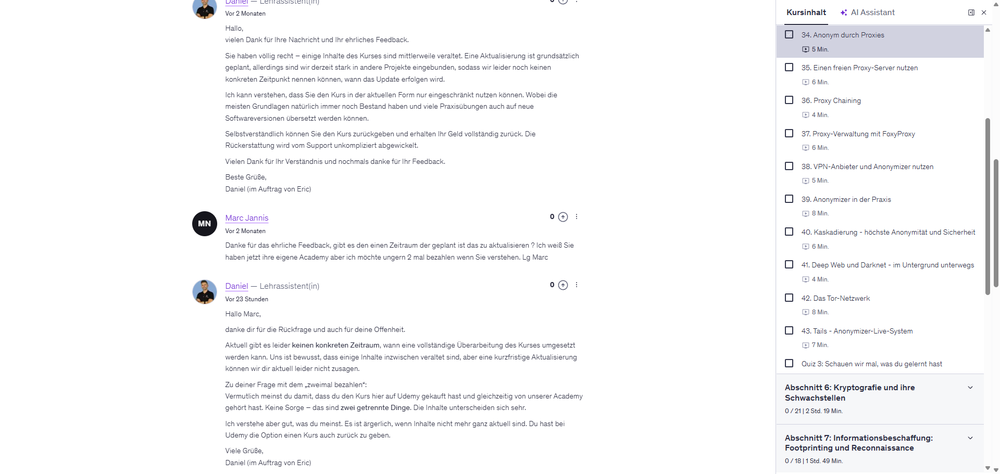
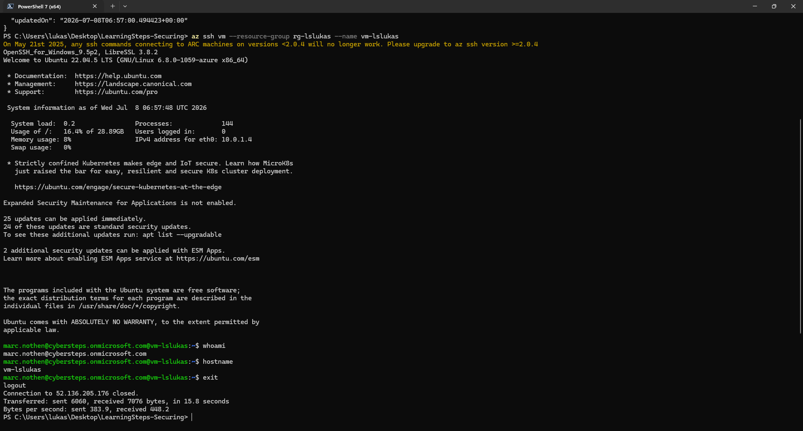
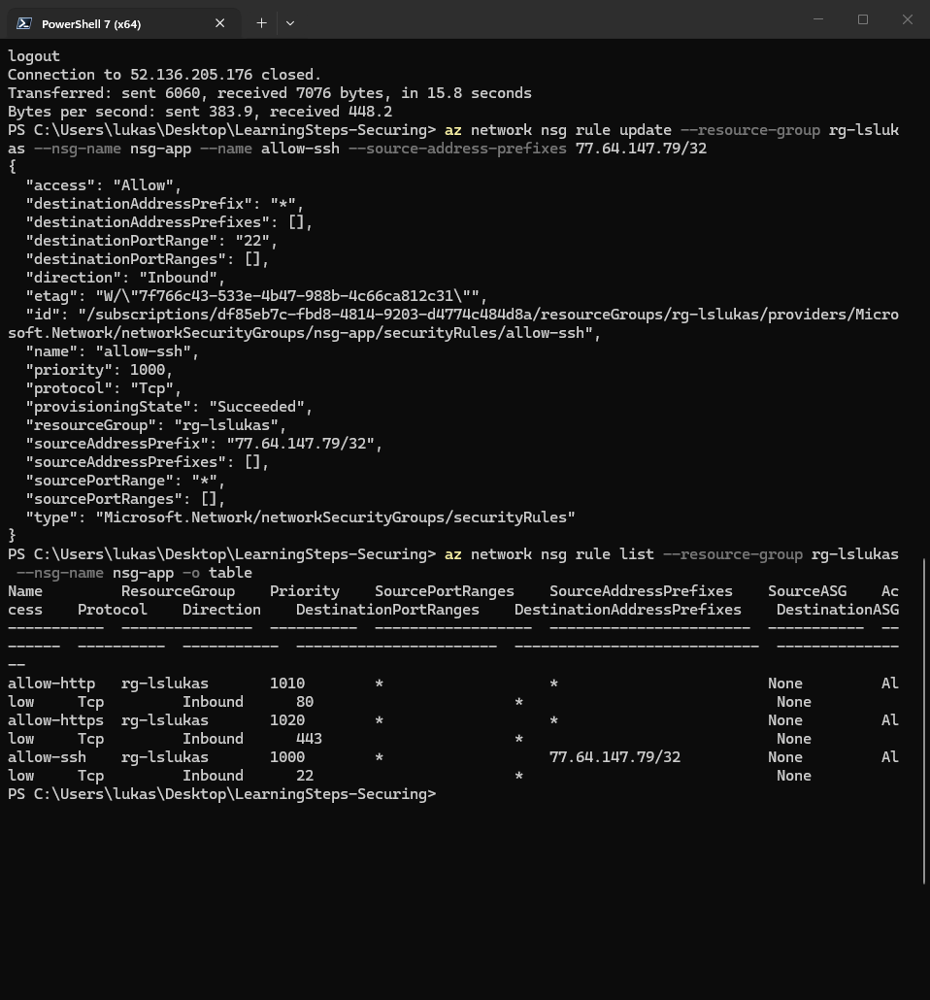
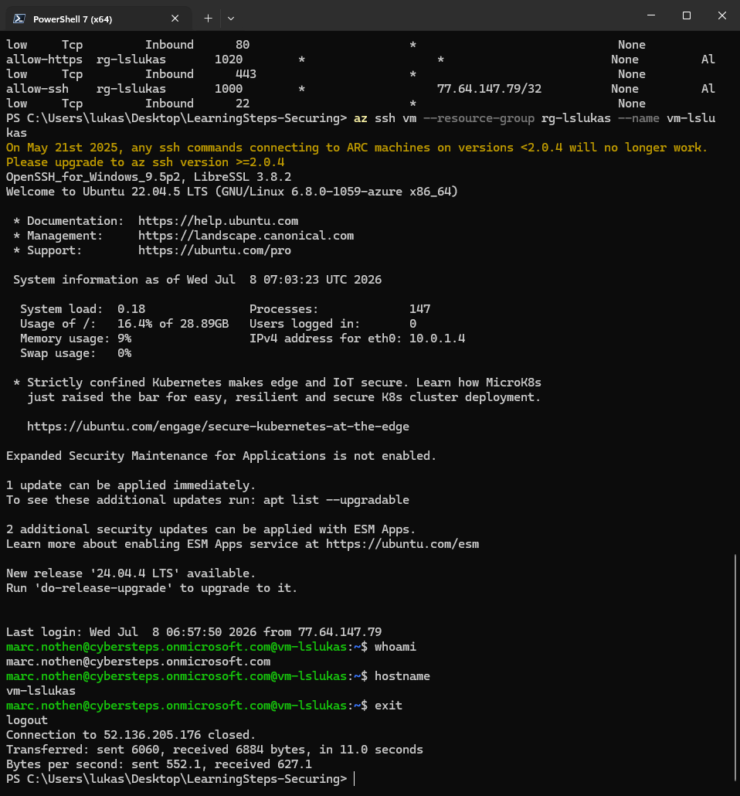

# Part 1 - Management Access Lockdown

## Goal

The goal of this part was to reduce the management access risk of the LearningSteps VM.

Before the change, SSH was reachable from the internet on port 22. After the change, SSH access is restricted to my public IP address and login is performed through Azure/Entra ID.

## Initial Risk

The baseline environment allowed inbound SSH traffic from any source.

Evidence:



This is risky because port 22 is continuously scanned on the internet. Even if password login is disabled, an exposed management port increases the attack surface.

## Azure/Entra ID Login

I assigned the `Virtual Machine User Login` role to my Azure user on the VM scope.

Evidence:



After the role assignment, I was able to connect with Azure SSH.

Evidence:



The `whoami` output confirms that the login used my Azure/Entra identity.

## SSH Network Restriction

I restricted the SSH NSG rule from any source to my current public IP address:

```text
77.64.147.79/32
```

Evidence:



## Final Verification

After the SSH restriction, I tested the login again with:

```powershell
az ssh vm --resource-group rg-lslukas --name vm-lslukas
whoami
hostname
exit
```

Evidence:



The final test proves that management access still works, but only from the allowed IP address and through Azure/Entra ID.

## Result

Part 1 is complete.

The management plane is now better protected because:

- SSH is no longer open to the entire internet.
- Access is limited to my current public IP.
- Login uses Azure/Entra ID instead of relying only on the static SSH key.
- The successful login was verified after the lockdown.