# Part 2 - TLS, Reverse Proxy and WAF Check

## Goal

The goal of this part was to place the LearningSteps application behind NPMplus as a reverse proxy, enable HTTPS/TLS, force HTTP traffic to HTTPS, and verify the current CrowdSec/AppSec WAF status.

Before this part, HTTPS was reachable, but the certificate was not trusted by the client. NPMplus was running, but no proxy host was configured for the LearningSteps application.

## Initial HTTP and HTTPS State

At the beginning of Part 2, HTTPS failed with a certificate trust error:

```text
SEC_E_UNTRUSTED_ROOT
```

HTTP already redirected to HTTPS:

```text
HTTP/1.1 301 Moved Permanently
Location: https://lslukas.westeurope.cloudapp.azure.com/
```

The Azure NSG allowed ports 80 and 443 publicly, while SSH was already restricted to my public IP from Part 1.

Evidence:

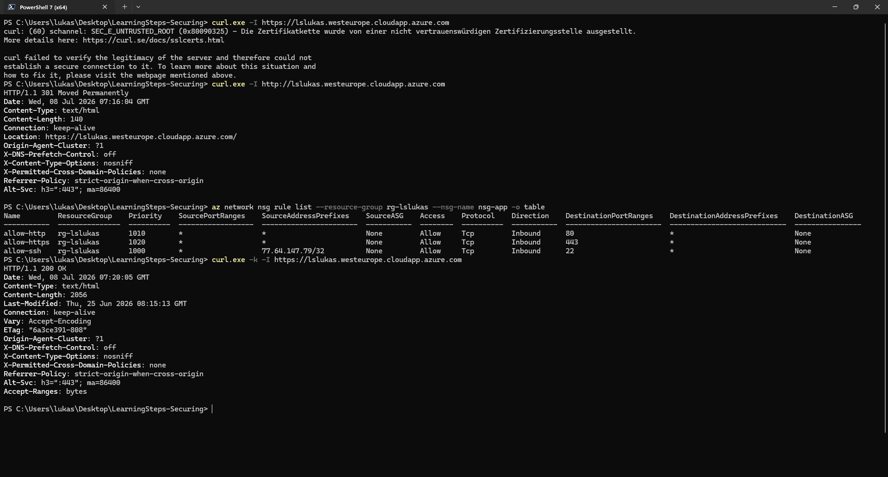

## NPMplus Admin Access Through SSH Tunnel

The NPMplus admin UI was accessed through an SSH tunnel instead of exposing the admin port publicly.

The tunnel maps my local port `8081` to port `81` on the VM:

```text
localhost:8081 -> VM localhost:81 -> NPMplus Admin UI
```

Evidence:

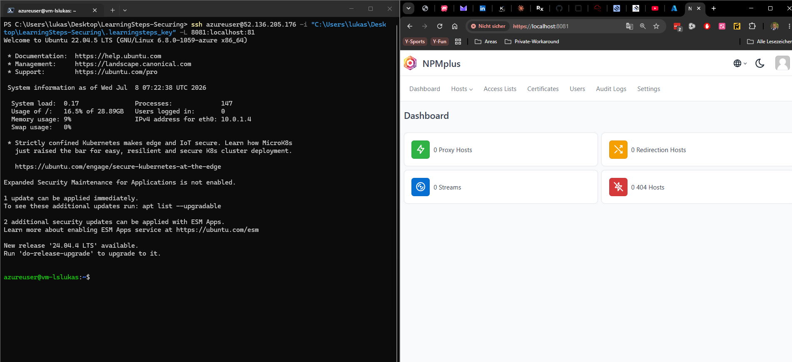

## No Proxy Host Configured

Inside NPMplus, there was initially no proxy host configured.

This meant NPMplus was running, but it did not yet know how to forward requests for the LearningSteps domain to the internal application.

Evidence:

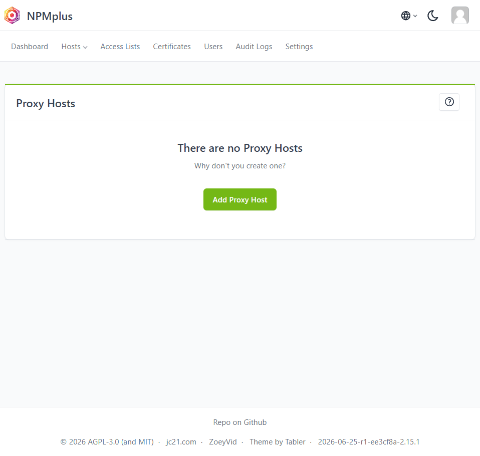

## Internal Application Port

On the VM, the application was identified as a local Uvicorn/FastAPI service listening on:

```text
127.0.0.1:8000
```

This is a good security pattern because the application is not directly exposed to the internet. Only the reverse proxy should forward traffic to it.

The intended request path is:

```text
Internet
  -> NPMplus on port 443
    -> 127.0.0.1:8000
      -> LearningSteps FastAPI application
```

## Proxy Host Configuration

A new proxy host was configured in NPMplus.

Configuration:

```text
Domain Name: lslukas.westeurope.cloudapp.azure.com
Scheme: http
Forward Hostname / IP: 127.0.0.1
Forward Port: 8000
Access: Publicly Accessible
```

Evidence:

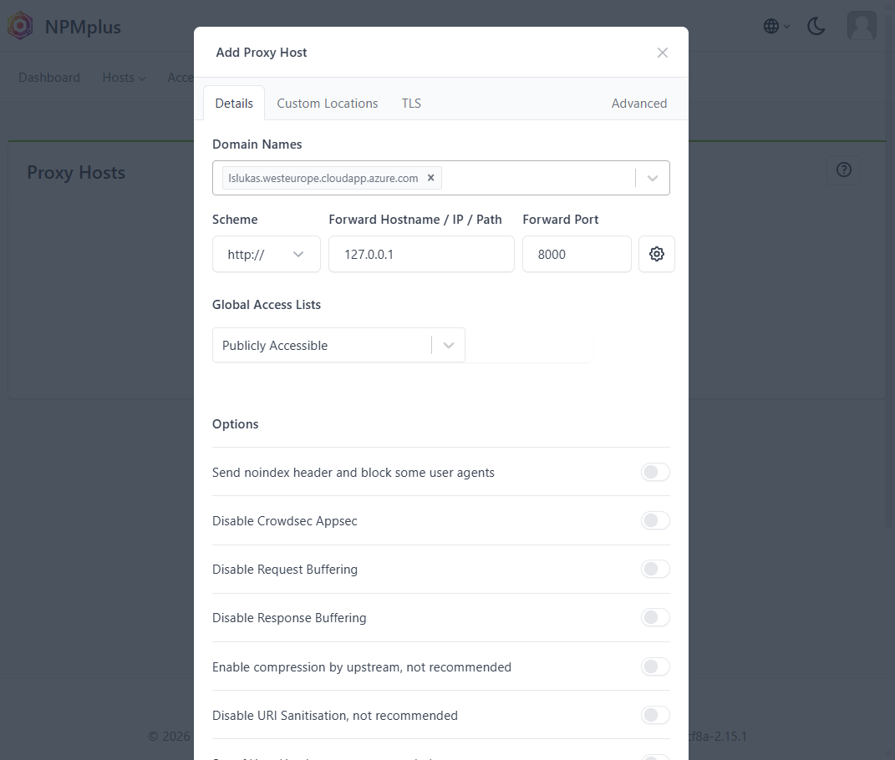

At this stage, the proxy host had no TLS certificate assigned yet.

Evidence:

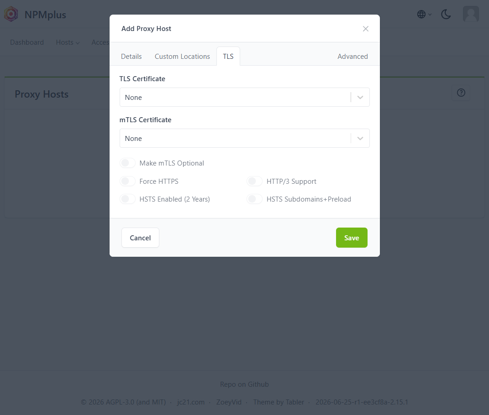

## TLS Certificate Creation

A new certificate was created using Certbot via HTTP.

This method works because port 80 is publicly reachable and Let's Encrypt can validate the domain through an HTTP challenge.

Evidence:

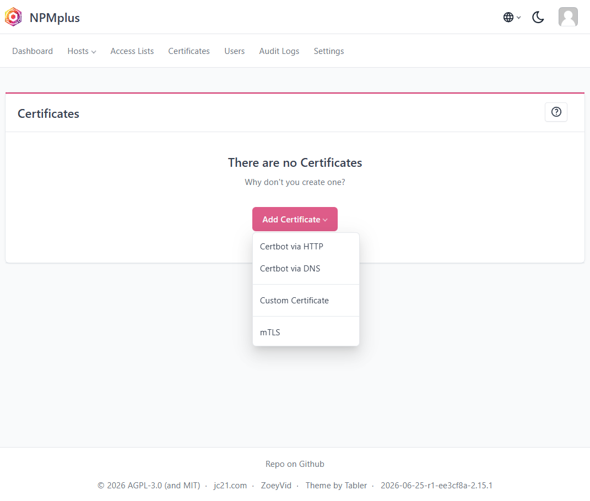

After creation, the certificate existed but was not yet assigned to a proxy host.

Evidence:

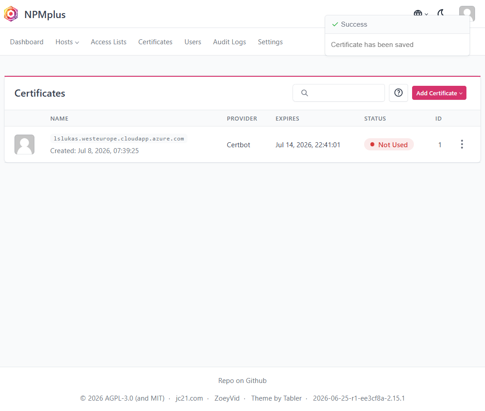

## Assigning TLS Certificate to Proxy Host

The created certificate was assigned to the LearningSteps proxy host.

The following TLS settings were used:

```text
TLS Certificate: lslukas.westeurope.cloudapp.azure.com
Force HTTPS: enabled
HTTP/3 Support: enabled
HSTS: disabled
mTLS: disabled
```

HSTS was intentionally left disabled for now because it should only be enabled after HTTPS has been fully verified.

Evidence:

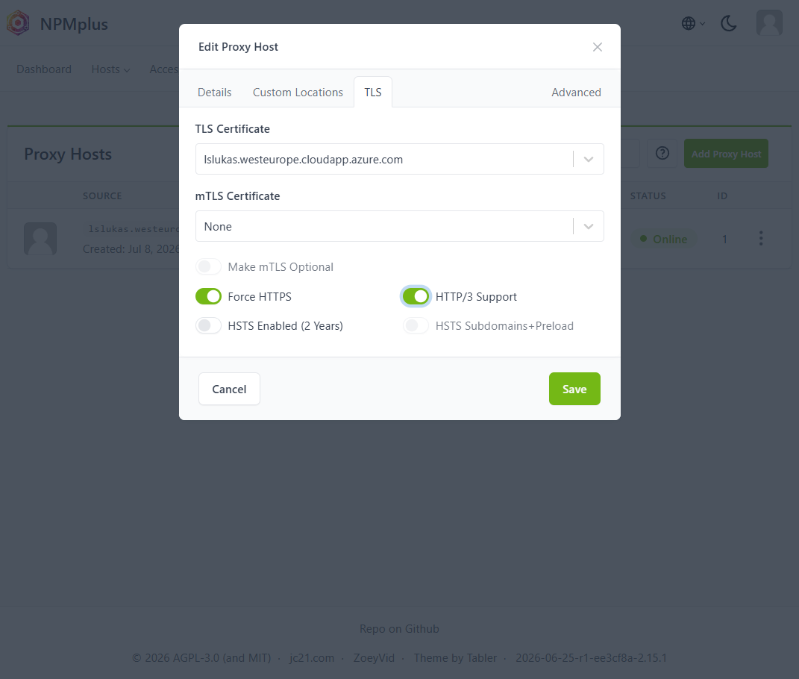

## Final TLS Verification

After assigning the certificate, HTTPS no longer failed with a certificate trust error.

The `/docs` endpoint returned the LearningSteps FastAPI Swagger UI over HTTPS:

```html
<title>LearningSteps API - Swagger UI</title>
```

HTTP also redirected to HTTPS with:

```text
HTTP/1.1 301 Moved Permanently
Location: https://lslukas.westeurope.cloudapp.azure.com/
```

Evidence:

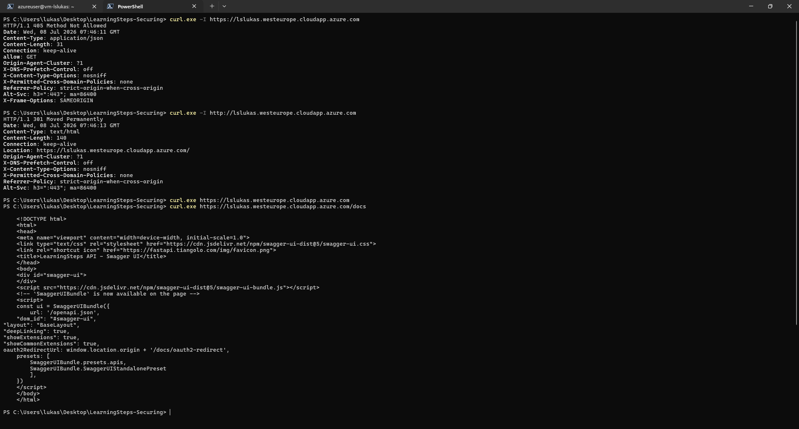

## CrowdSec Runtime Status

CrowdSec and NPMplus were both running as Docker containers.

The CrowdSec container was active, and the local API showed regular heartbeat and allowlist requests.

Enabled CrowdSec/AppSec collections included:

```text
crowdsecurity/appsec-crs
crowdsecurity/appsec-generic-rules
crowdsecurity/appsec-virtual-patching
crowdsecurity/base-http-scenarios
crowdsecurity/http-cve
crowdsecurity/modsecurity
ZoeyVid/npmplus
```

Evidence:

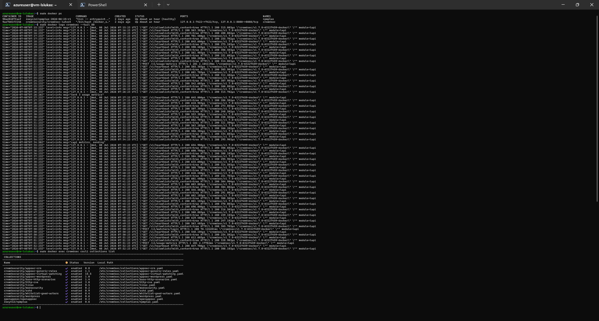

## WAF Test Requests

Several harmless test requests were sent to simulate common suspicious patterns:

```text
/?q=<script>alert(1)</script>
/?q=%3Cscript%3Ealert(1)%3C/script%3E
/?id=1%20OR%201=1
/.env
/wp-admin
/?file=../../../../etc/passwd
/?cmd=cat%20/etc/passwd
```

The responses were `307 Temporary Redirect` or `404 Not Found`.

No visible `403 Forbidden` block was returned during these tests.

Evidence:


CrowdSec showed:

```text
No active alerts
No active decisions
```

This means the tested payloads did not trigger a visible block, active alert, or active decision.

Evidence:

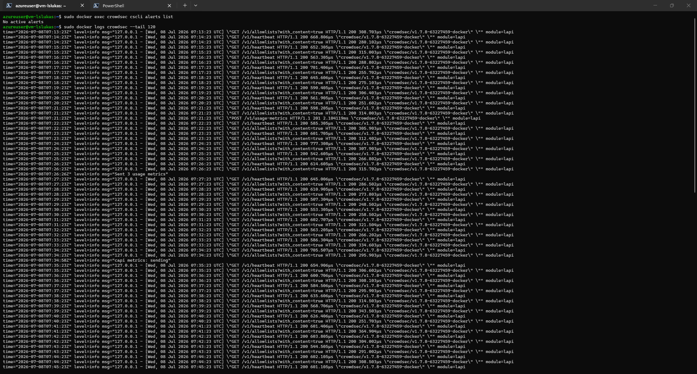

## Result

Part 2 is complete.

The TLS and reverse proxy configuration was successfully implemented:

- NPMplus now has a proxy host for the LearningSteps domain.
- The application is forwarded internally to `127.0.0.1:8000`.
- HTTPS works without certificate trust errors.
- HTTP redirects to HTTPS.
- The LearningSteps API documentation is reachable over HTTPS.
- CrowdSec is running.
- AppSec/WAF-related collections are enabled.

The WAF test result is documented honestly:

```text
CrowdSec/AppSec collections are enabled, but the sample requests did not trigger visible blocking, active alerts, or active decisions during this test.
```
