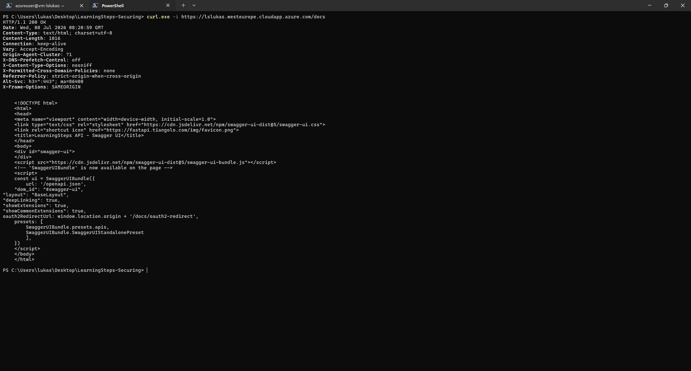
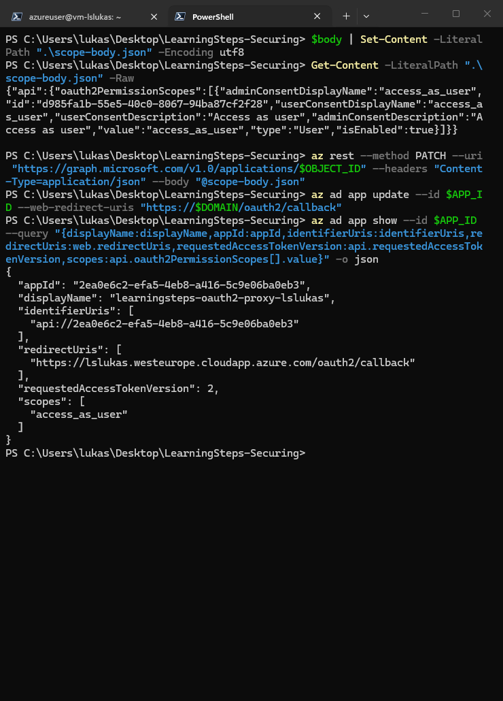
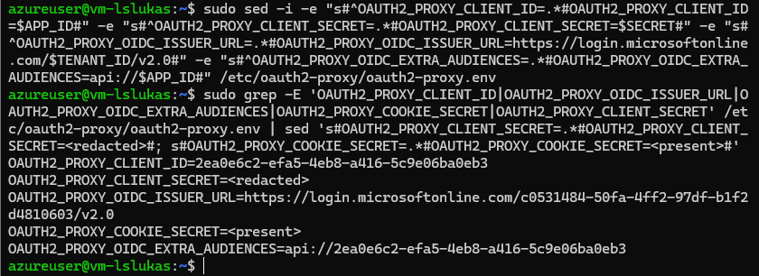
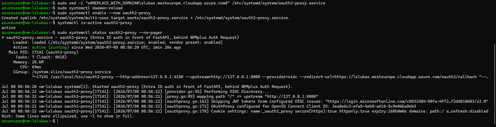
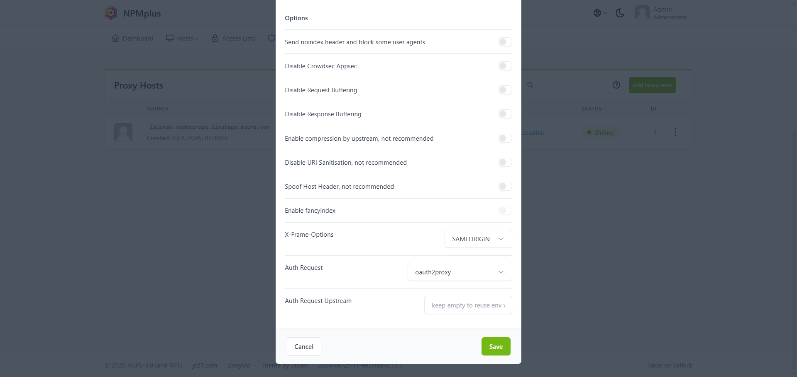
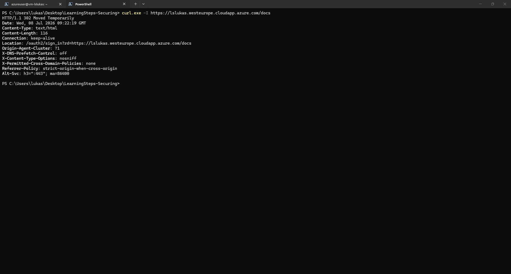
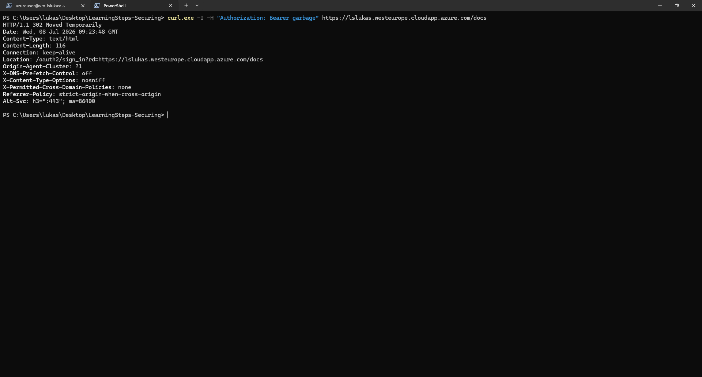
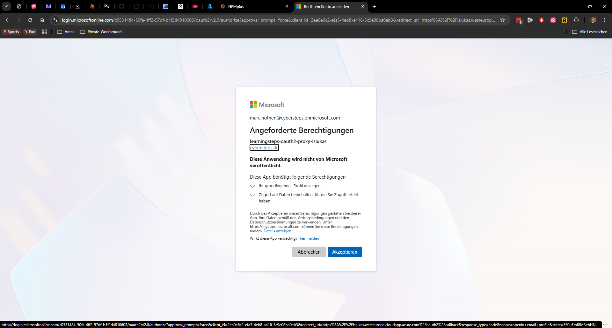

# Part 3 - Identity and Access Control

## Goal

The goal of this part was to protect the LearningSteps API with identity-based access control.

Before this part, the application was already reachable through NPMplus with HTTPS/TLS. However, the API documentation and application endpoints were still publicly reachable by anyone who knew the URL.

After this part, access to the application is no longer anonymous. Requests must pass through NPMplus, then through `oauth2-proxy`, and finally through Microsoft Entra ID authentication before they can reach the FastAPI application.

## Target Architecture

The request flow after Part 3 is:

```text
Browser / curl
   -> HTTPS via NPMplus
   -> NPMplus Auth Request
   -> oauth2-proxy on 127.0.0.1:4180
   -> Microsoft Entra ID login
   -> FastAPI on 127.0.0.1:8000
```

This is important because the FastAPI application itself was not changed. Instead, authentication was added in front of the application as an infrastructure layer.

That means:

- NPMplus still handles public HTTPS traffic.
- `oauth2-proxy` acts as the identity gatekeeper.
- Microsoft Entra ID decides whether the user is allowed to log in.
- FastAPI only receives requests after the authentication layer has accepted them.

## Initial State: API Publicly Reachable

Before enabling identity protection, the API documentation endpoint was reachable directly over HTTPS.

Evidence:



This was a security risk because `/docs` exposed the Swagger UI without requiring a user login. Even if the application only contains training data, public API documentation helps attackers understand available endpoints, request formats, and possible attack paths.

## Entra App Registration

To use Microsoft Entra ID as the identity provider, I created an application registration named:

```text
learningsteps-oauth2-proxy-lslukas
```

The app registration gives `oauth2-proxy` a known identity inside the tenant. It provides:

- an Application ID / Client ID
- a redirect URI
- an API identifier URI
- an exposed scope named `access_as_user`
- token configuration for access token version 2

Evidence:



The redirect URI is especially important:

```text
https://lslukas.westeurope.cloudapp.azure.com/oauth2/callback
```

This is the endpoint where Entra ID sends the user back after a successful login. If this URI is missing or wrong, the login flow cannot complete.

## oauth2-proxy Configuration

Next, I configured the existing `oauth2-proxy` environment file on the VM:

```text
/etc/oauth2-proxy/oauth2-proxy.env
```

The relevant configuration values are:

- `OAUTH2_PROXY_CLIENT_ID`: identifies the Entra application registration.
- `OAUTH2_PROXY_CLIENT_SECRET`: proves that oauth2-proxy is allowed to use this app registration.
- `OAUTH2_PROXY_OIDC_ISSUER_URL`: points to the Entra tenant login endpoint.
- `OAUTH2_PROXY_OIDC_EXTRA_AUDIENCES`: accepts tokens issued for the configured API identifier.
- `OAUTH2_PROXY_COOKIE_SECRET`: protects oauth2-proxy session cookies.

The secrets were verified only in redacted form.

Evidence:



This step matters because `oauth2-proxy` must know which Entra tenant to trust and which application registration it belongs to. Without these values, it cannot validate logins correctly.

## oauth2-proxy Service

After the configuration was written, I updated the systemd service file and replaced the placeholder domain with the real public domain:

```text
lslukas.westeurope.cloudapp.azure.com
```

Then I reloaded systemd and started the service:

```text
sudo systemctl daemon-reload
sudo systemctl enable --now oauth2-proxy
```

Evidence:



The service status shows that `oauth2-proxy` is active and running. It listens locally on:

```text
127.0.0.1:4180
```

This local-only binding is intentional. `oauth2-proxy` does not need to be exposed directly to the internet. NPMplus talks to it internally through the VM.

## NPMplus Auth Request

Running `oauth2-proxy` alone is not enough. NPMplus also has to be told to use it.

In the NPMplus proxy host configuration, I enabled the Auth Request integration and selected:

```text
oauth2proxy
```

Evidence:



This is the key enforcement point.

Without Auth Request, NPMplus would forward traffic directly to FastAPI. With Auth Request enabled, NPMplus first asks `oauth2-proxy` whether the incoming request has a valid authenticated session.

If the session is valid, the request continues to FastAPI.

If the session is missing or invalid, the user is redirected to the login flow.

## Test 1: Unauthenticated Request

I tested access to the API documentation without a browser session by using `curl`:

```powershell
curl.exe -I https://lslukas.westeurope.cloudapp.azure.com/docs
```

The response was:

```text
HTTP/1.1 302 Moved Temporarily
Location: /oauth2/sign_in?rd=https://lslukas.westeurope.cloudapp.azure.com/docs
```

Evidence:



This proves that anonymous access is no longer allowed. Instead of returning `200 OK`, the application redirects the client to the authentication flow.

## Test 2: Invalid Bearer Token

I also tested whether a random bearer token would be accepted:

```powershell
curl.exe -I -H "Authorization: Bearer garbage" https://lslukas.westeurope.cloudapp.azure.com/docs
```

The response was again a redirect to the login flow:

```text
HTTP/1.1 302 Moved Temporarily
Location: /oauth2/sign_in?rd=https://lslukas.westeurope.cloudapp.azure.com/docs
```

Evidence:



This proves that sending an arbitrary `Authorization` header is not enough. The request still needs a valid session created through the Entra login flow.

## Test 3: Browser Login

Finally, I tested the normal user flow in the browser:

```text
https://lslukas.westeurope.cloudapp.azure.com/docs
```

After authentication through Microsoft Entra ID, the API documentation became reachable again.

Evidence:



This confirms the desired behavior:

- anonymous clients are redirected to login
- invalid bearer tokens are not accepted
- authenticated users can access the application

## Result

Part 3 is complete.

The application is now protected by identity-based access control:

- The API is no longer anonymously reachable.
- HTTPS still terminates at NPMplus.
- NPMplus uses Auth Request to enforce authentication.
- `oauth2-proxy` validates sessions through Microsoft Entra ID.
- FastAPI remains private behind the proxy and receives only authenticated traffic.

This improves the security posture significantly because public access is no longer based only on knowing the URL. A user now needs a valid Microsoft Entra ID authentication session before reaching the application.
