# Part 4 - Data Isolation and Private PostgreSQL Access

## Goal

The goal of this part was to remove the PostgreSQL database from public internet access and move it into the private Azure network path.

Before this part, the database was publicly reachable through the Azure PostgreSQL public endpoint and an `allow-all` firewall rule. After this part, public network access is disabled, PostgreSQL uses a delegated private subnet, and name resolution is handled through Azure Private DNS.

In simple terms: the application can still use the database from inside Azure, but my laptop and the public internet can no longer connect to it directly.

## Why This Matters

A public PostgreSQL database is a high-risk target because it stores the application data. If the database is reachable from the internet, attackers can scan the endpoint, try credentials, exploit misconfiguration, or attack exposed database services directly.

It is not enough to just click something like "private access" in Azure without understanding the full path. The application, DNS, subnet, Terraform state, and backup strategy all have to fit together. Otherwise the database may become private, but the app may no longer find it, or data may be lost during replacement.

The backup was not optional. Terraform had to replace the PostgreSQL Flexible Server to move it into the delegated subnet and private DNS setup. Replacement means the old database can be destroyed and recreated. Without a verified backup, this would risk losing the application data.

## Initial Tooling Check

First, I checked whether PostgreSQL client tools were available. On Windows, `psql` and `pg_dump` were not initially available in PATH, so I installed PostgreSQL tools and used the PostgreSQL binary path. On the VM, the PostgreSQL client tools were already available.

Evidence:

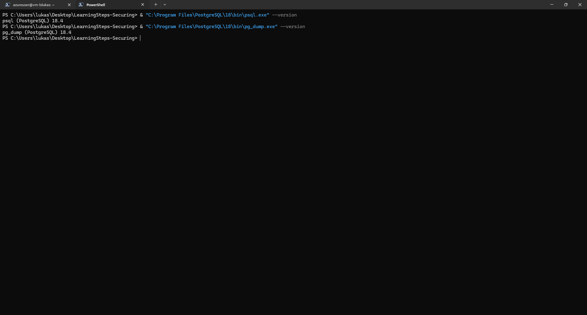

The VM had PostgreSQL client tooling available:

```text
psql (PostgreSQL) 16.14
```

Evidence:

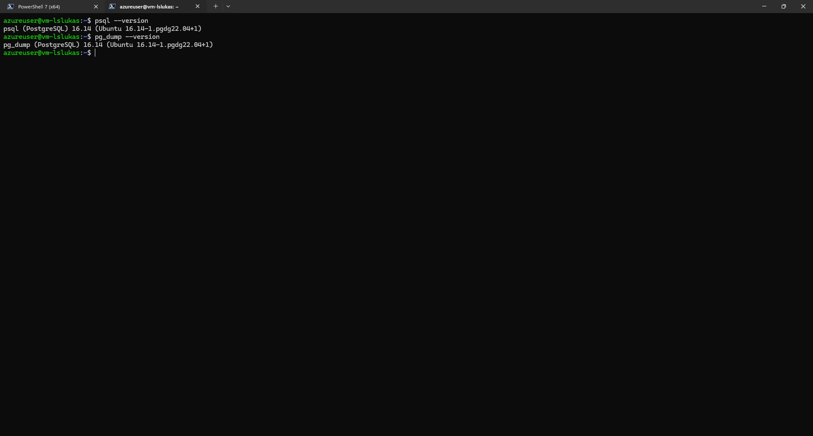

## Initial Public Database Exposure

At the beginning of Part 4, the Azure PostgreSQL firewall still had an `allow-all` rule:

```text
StartIpAddress: 0.0.0.0
EndIpAddress:   255.255.255.255
```

This means the database firewall was configured in a very permissive way. Even if credentials are still required, the database endpoint is exposed to scanning and connection attempts from the internet.

Evidence:

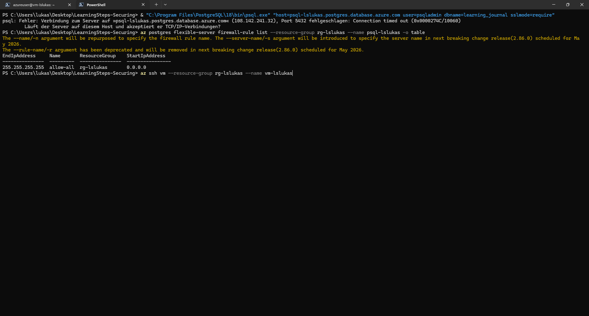

The PostgreSQL server was also running with public network access enabled:

```text
State: Ready
PublicNetworkAccess: Enabled
```

Evidence:

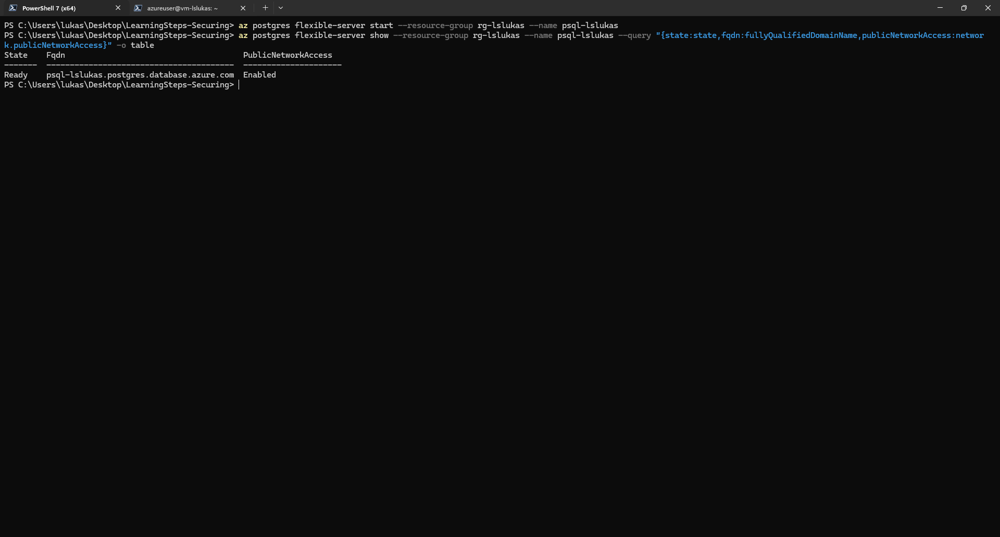

## Baseline Database Connection and Data Check

Before changing the infrastructure, I connected to the database from the VM and confirmed the current state.

Command used on the VM:

```bash
psql "host=psql-lslukas.postgres.database.azure.com user=psqladmin dbname=learning_journal sslmode=require"
```

The connection confirmed:

- Database: `learning_journal`
- User: `psqladmin`
- Host: `psql-lslukas.postgres.database.azure.com`
- TLS was active

Evidence:

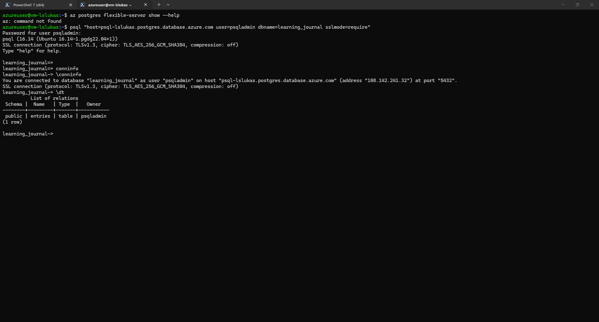

Then I checked the data count:

```sql
SELECT COUNT(*) FROM entries;
```

Result:

```text
2
```

Evidence:

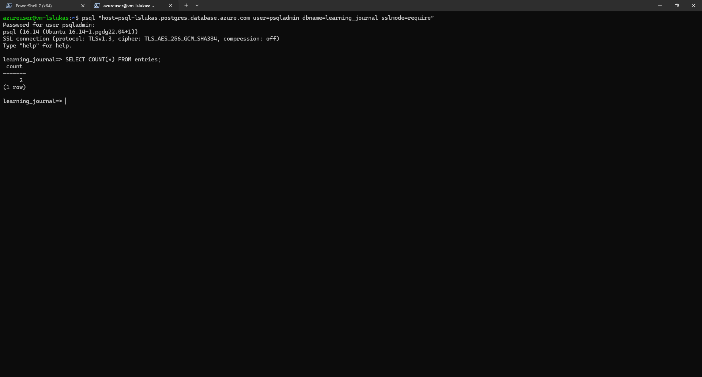

This row count became the reference value for the restore verification later.

## Backup Before Destructive Infrastructure Change

Before applying Terraform, I created a database backup with `pg_dump`.

Command used on the VM:

```bash
pg_dump "postgresql://psqladmin@psql-lslukas.postgres.database.azure.com/learning_journal?sslmode=require" > backup.sql
```

The command connects to the source database and writes a SQL dump into `backup.sql`.

The backup was then verified with:

```bash
ls -lh backup.sql
head -n 20 backup.sql
grep -n "CREATE TABLE public.entries" backup.sql
grep -n "COPY public.entries" backup.sql
```

The important proof was that the dump contained both the table definition and the table data section:

```text
CREATE TABLE public.entries
COPY public.entries
```

Evidence:

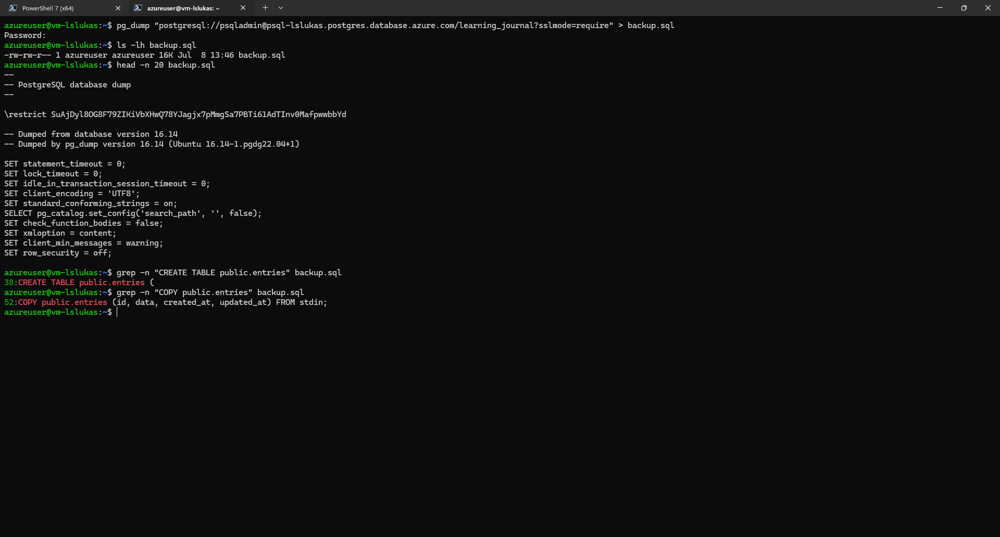

I also copied the backup to my local machine. This mattered later because the database replacement removed the old data and the restore had to be performed from the saved dump.

## Terraform Changes

The Terraform configuration was changed to move PostgreSQL to private access.

In `network.tf`, I added a dedicated delegated database subnet:

```hcl
resource "azurerm_subnet" "db" {
  name                 = "snet-db"
  resource_group_name  = azurerm_resource_group.main.name
  virtual_network_name = azurerm_virtual_network.main.name
  address_prefixes     = ["10.0.2.0/24"]

  delegation {
    name = "postgresql-flexible-server"

    service_delegation {
      name    = "Microsoft.DBforPostgreSQL/flexibleServers"
      actions = ["Microsoft.Network/virtualNetworks/subnets/join/action"]
    }
  }
}
```

This subnet is specifically delegated to Azure Database for PostgreSQL Flexible Server. Delegation tells Azure that this subnet is reserved for that service type.

I also added a private DNS zone and linked it to the VNet:

```hcl
resource "azurerm_private_dns_zone" "postgres" {
  name                = "privatelink.postgres.database.azure.com"
  resource_group_name = azurerm_resource_group.main.name
}

resource "azurerm_private_dns_zone_virtual_network_link" "postgres" {
  name                  = "pdnslink-postgres-${var.prefix}"
  resource_group_name   = azurerm_resource_group.main.name
  private_dns_zone_name = azurerm_private_dns_zone.postgres.name
  virtual_network_id    = azurerm_virtual_network.main.id
}
```

The private DNS zone is important because the application still uses the PostgreSQL FQDN, but that name now needs to resolve correctly from inside the Azure VNet.

In `postgresql.tf`, I disabled public network access and connected PostgreSQL to the delegated subnet and private DNS zone:

```hcl
public_network_access_enabled = false
delegated_subnet_id           = azurerm_subnet.db.id
private_dns_zone_id           = azurerm_private_dns_zone.postgres.id
```

I removed the old public firewall rule:

```hcl
resource "azurerm_postgresql_flexible_server_firewall_rule" "allow_all" {
  name             = "allow-all"
  server_id        = azurerm_postgresql_flexible_server.main.id
  start_ip_address = "0.0.0.0"
  end_ip_address   = "255.255.255.255"
}
```

In `vm.tf`, I removed the dependency on the deleted firewall rule.

One important correction was also made in `network.tf`: the SSH NSG rule was kept restricted to my public IP address from Part 1:

```hcl
source_address_prefix = "77.64.147.79/32"
```

This was necessary because Terraform otherwise wanted to revert the manual Part 1 hardening back to `*`.

## Terraform Validation and Plan

After editing the Terraform files, I ran:

```powershell
terraform fmt
terraform validate
terraform plan
```

The plan showed the intended private PostgreSQL migration:

```text
public_network_access_enabled = true -> false
```

It also showed that the PostgreSQL server had to be replaced because delegated subnet and private DNS settings force replacement on this resource.

Evidence:

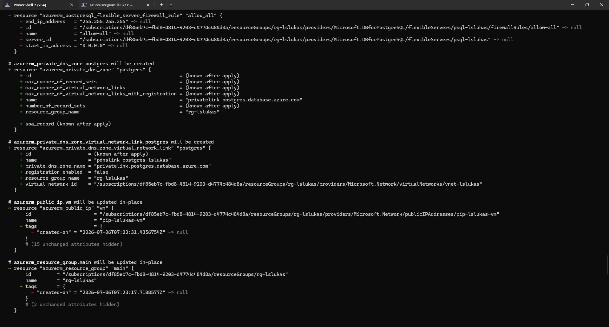

## Terraform Apply

After confirming that the backup existed and the plan was correct, I applied the Terraform changes:

```powershell
terraform apply
```

This was the destructive step. Terraform replaced the PostgreSQL Flexible Server and recreated the private networking configuration.

Evidence:

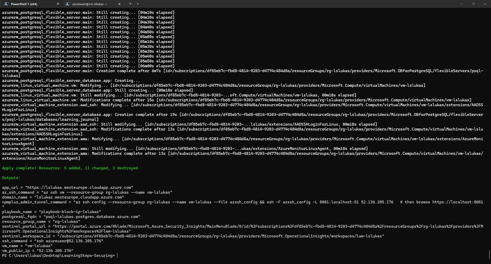

## Public Access Disabled

After the apply, I checked the PostgreSQL server state through Azure CLI:

```powershell
az postgres flexible-server show --resource-group rg-lslukas --name psql-lslukas --query "{state:state,fqdn:fullyQualifiedDomainName,publicNetworkAccess:network.publicNetworkAccess}" -o table
```

Result:

```text
State: Ready
PublicNetworkAccess: Disabled
```

Evidence:

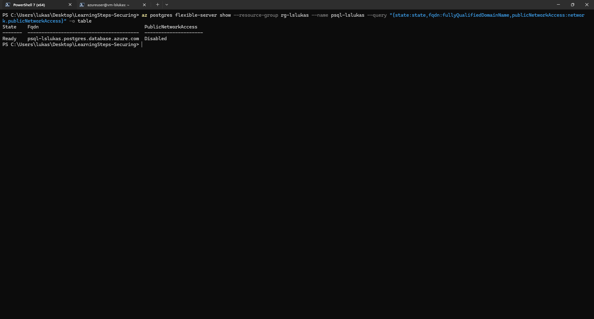

This proves the database no longer exposes public network access.

## Public Laptop Connection Blocked

Next, I tested the old public connection path from my local machine:

```powershell
& "C:\Program Files\PostgreSQL\18\bin\psql.exe" "host=psql-lslukas.postgres.database.azure.com user=psqladmin dbname=learning_journal sslmode=require"
```

The connection failed because the hostname could no longer be resolved publicly:

```text
Name or service not known
```

Evidence:

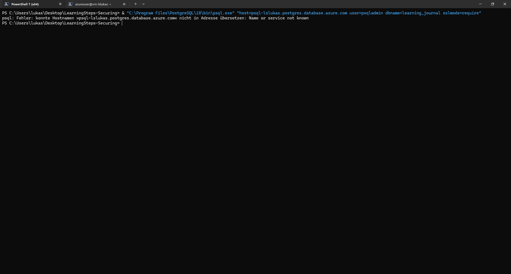

This is expected. The database name is now handled through the private DNS path inside Azure instead of public DNS from my laptop.

## Private VM Connection Still Works

Then I tested from the VM inside Azure:

```bash
psql "host=psql-lslukas.postgres.database.azure.com user=psqladmin dbname=learning_journal sslmode=require"
```

This connection worked. That proves the internal network and private DNS path are functioning.

Evidence:

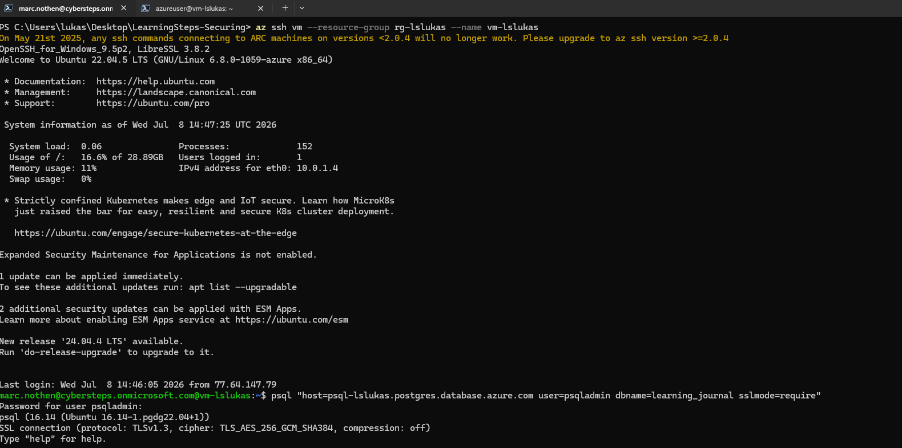

At this point, the database was private and reachable internally. However, the data was missing because Terraform had replaced the database server.

## Restore From Backup

After the replacement, the `entries` table no longer existed. This confirmed why the backup was necessary.

I restored the backup into the new private database:

```bash
psql "host=psql-lslukas.postgres.database.azure.com user=psqladmin dbname=learning_journal sslmode=require" < /tmp/backup.sql
```

The backup recreated the `entries` table and restored the data.

I verified this with:

```sql
\dt
SELECT COUNT(*) FROM entries;
```

Result:

```text
entries table exists
COUNT(*) = 2
```

Evidence:

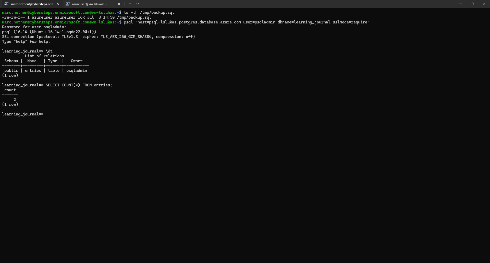

This proves that the data was successfully restored after the private database migration.

## Application Verification

Finally, I checked that the application was still reachable through the protected HTTPS path:

```powershell
curl.exe -I https://lslukas.westeurope.cloudapp.azure.com/docs
```

The application still redirected unauthenticated access to oauth2-proxy:

```text
HTTP/1.1 302
Location: /oauth2/sign_in?rd=...
```

Evidence:

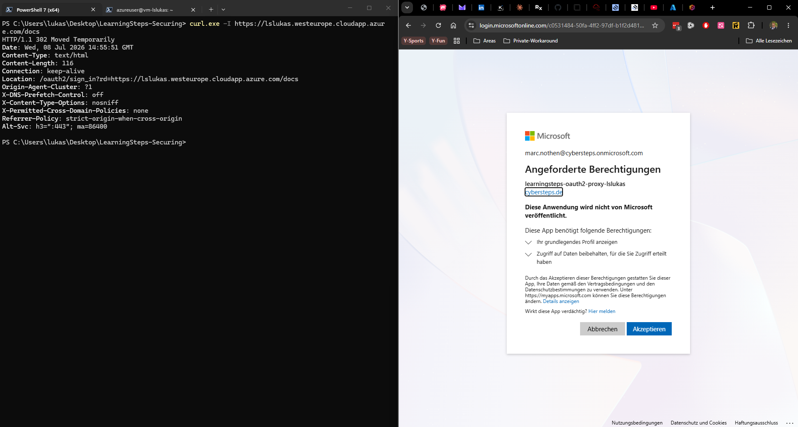

This means the previous security layers from Part 2 and Part 3 still work after the database migration.

## Firewall Rule Removed

As a final Azure-side check, I listed the PostgreSQL firewall rules:

```powershell
az postgres flexible-server firewall-rule list --resource-group rg-lslukas --name psql-lslukas -o table
```

The old public `allow-all` rule was no longer present.

Evidence:

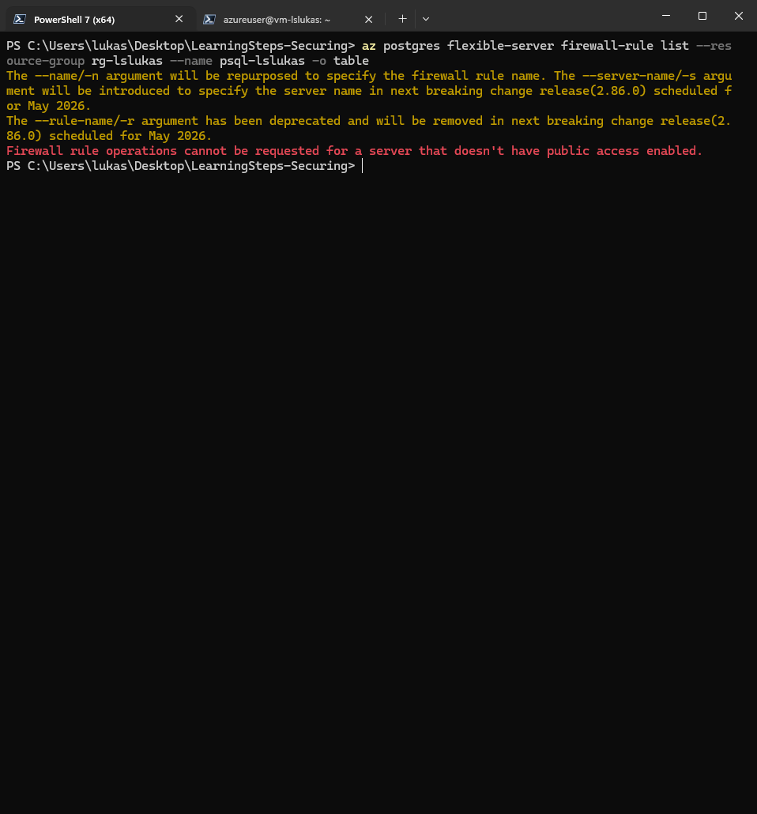

## Result

Part 4 is complete.

The database layer is now better protected because:

- PostgreSQL public network access is disabled.
- The old `allow-all` public firewall rule was removed.
- PostgreSQL is connected to a delegated private subnet.
- Private DNS is linked to the Azure VNet.
- The VM can still reach the database internally.
- My laptop can no longer reach the database publicly.
- The database backup was restored successfully.
- The application remains protected through HTTPS and oauth2-proxy.

The most important final proof is the combination of these checks:

```text
PublicNetworkAccess = Disabled
Local laptop connection = blocked
VM private connection = successful
entries row count = 2
```
